<p align="center">
  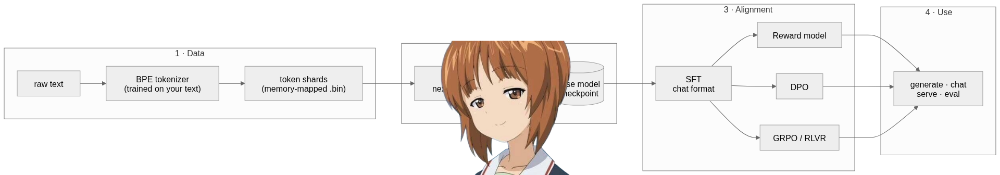
</p>

# Text-LLM-Training-from-scratch

A from-scratch implementation of the language-model training pipeline in PyTorch, covering
tokenization, pretraining, supervised fine-tuning, and preference-based alignment (reward
modeling, DPO, and GRPO/RLVR). The code is written using PyTorch's tensor and autograd
primitives directly, rather than higher-level training frameworks such as `transformers`,
`trl`, or `peft`, and each stage is organized to be read and understood on its own.

The model is a decoder-only Transformer using the components found in contemporary open
models: rotary position embeddings (RoPE), RMSNorm, SwiGLU feed-forward layers,
grouped-query attention, and a key/value cache for generation. Device and precision
selection is centralized in a single module, so the same code runs on CPU, Apple Silicon
(MPS), and CUDA GPUs without modification.

Author: [y0oshi](https://github.com/Y0oshi). License: MIT.

## Table of contents

- [System overview](#system-overview)
- [Requirements](#requirements)
- [Installation](#installation)
- [Quickstart](#quickstart)
- [Two interfaces](#two-interfaces)
- [Example: a 17M-parameter model](#example-a-17m-parameter-model)
- [How each stage works](#how-each-stage-works)
  - [Tokenizer: byte-level BPE](#tokenizer-byte-level-bpe)
  - [Data pipeline: memory-mapped token shards](#data-pipeline-memory-mapped-token-shards)
  - [Model: a decoder-only Transformer](#model-a-decoder-only-transformer)
  - [Generation: the key/value cache](#generation-the-keyvalue-cache)
- [Alignment](#alignment)
  - [Supervised fine-tuning with prompt masking](#supervised-fine-tuning-with-prompt-masking)
  - [Reward model](#reward-model)
  - [Direct Preference Optimization](#direct-preference-optimization)
  - [GRPO with verifiable rewards](#grpo-with-verifiable-rewards)
- [Serving and evaluation](#serving-and-evaluation)
- [Hardware and scaling](#hardware-and-scaling)
- [Repository layout](#repository-layout)
- [Tests](#tests)
- [License](#license)

## System overview

The pipeline proceeds in four phases: data preparation, pretraining, alignment, and
inference. Each stage reuses the same Transformer, and each edge in the figure corresponds
to one `llm` command. A single principle runs throughout: encode text as tokens, train the
model to predict the next token, then vary the data and the loss until the behavior matches
the objective. The diagram distinguishes the persistent artifacts (`tok.json`,
`train.bin`, checkpoints) from the commands that produce and consume them.


## Requirements

- Python 3.10 or newer
- PyTorch 2.1 or newer
- NumPy and tqdm

## Installation

```bash
git clone https://github.com/Y0oshi/Text-LLM-Training-from-scratch.git
cd Text-LLM-Training-from-scratch
pip install -e .
```

This installs the core dependencies listed above and the `llm` command. Two optional
extras are available:

| Extra | Purpose | Command |
|---|---|---|
| `tiktoken` | use a pretrained GPT-2 tokenizer instead of training one | `pip install -e ".[tiktoken]"` |
| `dev` | run the test suite (pytest, ruff) | `pip install -e ".[dev]"` |

On CUDA systems, if the default PyTorch build does not detect the GPU, install the matching
PyTorch wheel first as described at [pytorch.org](https://pytorch.org). CPU and Apple
Silicon require no additional step.

## Quickstart

The repository includes a small example corpus, so the complete loop can be exercised
before supplying your own data. The corpus is tiny, so this completes quickly on CPU:

```bash
llm tokenizer train --input examples/tiny_corpus.txt --vocab-size 512 --out tok.json
llm data --tokenizer tok.json --input examples/tiny_corpus.txt --out-dir data
llm pretrain --config configs/tiny.json
llm generate --ckpt checkpoints/final.pt --tokenizer tok.json \
    --prompt "The sun rose" --temperature 0 --max-new-tokens 40
```

Running `llm` with no arguments performs the same four steps through an interactive menu.

## Two interfaces

Running `llm` with no arguments opens an interactive menu that walks through every stage:
options are selected with the arrow keys, confirmed with Enter, and dismissed with Esc, and
text is entered in the highlighted input fields when requested. Before executing anything,
the menu prints the exact `llm ...` command it constructed, which makes the command-line
usage visible from the outset.

The commands can also be invoked directly. The menu performs every action by building,
displaying, and running these same commands, so the two interfaces cannot diverge: the menu
is a command builder, not a second implementation.


## Example: a 17M-parameter model

The included `configs/tinystories-15m.json` defines a 17.3M-parameter model. Trained on the
[TinyStories](https://huggingface.co/datasets/roneneldan/TinyStories) dataset for 30M
tokens (3,700 optimizer steps at batch size 32 and context length 256), the validation loss
decreases from 9.0 to 1.90 (perplexity 6.59), and the model produces coherent short
narratives. This illustrates the output of the architecture at small scale rather than a
benchmark result.

| Metric | Value |
|---|---|
| Parameters | 17.3M |
| Tokens seen | 30M (3,700 steps, batch 32, context 256) |
| Validation loss | 9.0 to 1.90 |
| Perplexity | 6.59 |

An unedited sample (prompt in bold):

> **Once upon a time, there was a little girl named Mia.** Mia was very creative and loved
> to create things. One day, Mia's mom asked her to help make a house for her favorite
> toy. Mia thought that was a good idea and ran to her room to do her job. Mia's mom was
> very proud of her and told her how happy she was.

To reproduce, download TinyStories and run:

```bash
llm tokenizer train --input tinystories.txt --vocab-size 8192 --out tok.json
llm data --tokenizer tok.json --input tinystories.txt --out-dir data --doc-sep '<|endoftext|>'
llm pretrain --config configs/tinystories-15m.json
```

# How each stage works

## Tokenizer: byte-level BPE

Text is first split into word-like chunks by a regular expression, so merges do not straddle
word boundaries, and each chunk is then reduced to its raw UTF-8 bytes. Because the base
alphabet is the 256 byte values, no input is ever out of vocabulary: any string in any
language encodes to some sequence of tokens. Training repeats a single step, counting all
adjacent token pairs and merging the most frequent pair into a new token, and records the
resulting ordered merge table until the target vocabulary size is reached. Encoding replays
those merges in learned order; decoding concatenates the byte strings of each token.

The implementation is roughly 200 lines in `textllm/tokenizer/bpe.py`, with save/load and
special-token support. On the TinyStories corpus it reaches 4.05 characters per token at a
vocabulary size of 8192. To use a pretrained encoding instead, pass `--tokenizer
tiktoken:gpt2` to any command and set `model.vocab_size` to at least 50257.


## Data pipeline: memory-mapped token shards

Tokens are stored as a single flat `uint16` file and memory-mapped during training, so the
corpus never has to fit in RAM; the trainer draws random windows directly from disk without
materializing a shuffled index. Each training item is a window of `context_length + 1`
tokens, where the inputs are the first `T` positions and the targets are the same window
shifted by one. The `--doc-sep` option keeps documents intact: each document is encoded
separately, its full encoded separator is appended, and the train/validation split falls on
document boundaries rather than mid-sentence. The builder verifies that token ids fit the
shard dtype before writing, so an oversized vocabulary fails with a clear error instead of
overflowing.


## Model: a decoder-only Transformer

The architecture follows the design used by current open models rather than the original
2017 formulation. Each component and its rationale:

| Component | Replaces | Rationale |
|---|---|---|
| RoPE (`model/rope.py`) | learned position table | rotates queries and keys by a position-dependent angle, so attention scores depend only on relative distance and extrapolate beyond the training length |
| RMSNorm (`model/norm.py`) | LayerNorm | removes mean-centering and bias; cheaper and equally stable in practice |
| SwiGLU (`model/mlp.py`) | ReLU MLP | a gated activation that outperforms ReLU at equal parameter count |
| GQA (`model/attention.py`) | full multi-head attention | query heads share key/value heads, shrinking the cache and speeding decoding |
| Weight tying and scaled init | separate embedding and head | input and output share one matrix; residual projections are scaled by 1/√(2N) so activation variance is preserved with depth |

Attention is computed through `torch.scaled_dot_product_attention`, a single portable kernel
that is efficient on CPU, MPS, and CUDA (selecting a FlashAttention implementation on
capable GPUs). An explicit reference implementation is provided alongside it, selected by a
configuration flag, and a test confirms that the two agree numerically. The figure shows the
full residual block together with the two features most relevant at inference time,
grouped-query attention and the key/value cache. A more detailed treatment is in
[docs/architecture.md](docs/architecture.md).


## Generation: the key/value cache

Without a cache, generating each new token would recompute attention over all preceding
tokens, giving decoding cost that grows quadratically with sequence length. With a cache the
prompt is processed once (the prefill), every past key and value is retained, and each
subsequent token requires only a single-token forward pass and attention over the cached
positions, giving linear cost. A regression test confirms that cached decoding matches the
full recomputation to within approximately 1e-7.


# Alignment

## Supervised fine-tuning with prompt masking

Conversations are rendered into a ChatML-style token stream (`textllm/chat_template.py`).
Only the assistant's tokens contribute to the loss; every other position (system prompt,
user text, and role markers) is set to the ignore index, so the model is trained to respond
rather than to reproduce its inputs. A test asserts precisely which positions are
supervised.

Data format (JSONL, one conversation per line):

```json
{"messages": [{"role": "user", "content": "What is the capital of France?"},
              {"role": "assistant", "content": "The capital of France is Paris."}]}
```


## Reward model

A single linear head on the Transformer's final hidden state assigns a scalar score to a
sequence, read at its last real token. Training increases the score of the chosen response
relative to the rejected one, following the Bradley-Terry model of pairwise preference. The
backbone is the same `Transformer` class, attached through the `forward_hidden()` interface,
so no model code is duplicated.


## Direct Preference Optimization

DPO requires neither a separate reward model nor a sampling loop. It directly increases the
policy's log-probability of chosen responses relative to rejected ones, measured against a
frozen copy of the starting policy, which prevents the model from drifting into degenerate
solutions that would nominally satisfy the objective. The coefficient β controls the
strength of the preference signal. The implementation uses the summed response-token
log-probabilities of the original formulation; length normalization corresponds to a
different objective. Because it samples no rollouts, DPO is inexpensive to run.

Data format: `{"prompt": [...messages], "chosen": "good reply", "rejected": "bad reply"}`.


## GRPO with verifiable rewards

In GRPO the reward is a program rather than a learned model, verifying a final answer, a
format, or the presence of a substring, which is the basis of the name RLVR (reinforcement
learning with verifiable rewards). The method normalizes rewards within each group of
sampled completions, so the group mean serves as the baseline that PPO would otherwise
obtain from a separate value network. A KL term keeps the policy close to a frozen reference
while the reward drives it toward above-average completions. Reward functions are defined in
`textllm/train/rewards.py`.

```bash
llm grpo --base sft_ckpt/final.pt --tokenizer tok.json \
    --prompts prompts.txt --contains "the answer is"
```


# Serving and evaluation

```bash
llm chat  --ckpt sft_ckpt/final.pt --tokenizer tok.json    # streaming REPL
llm serve --ckpt sft_ckpt/final.pt --tokenizer tok.json    # HTTP on port 8000
curl -X POST localhost:8000/generate -d '{"prompt": "Once upon a time", "max_new_tokens": 64}'

llm eval ppl --ckpt checkpoints/final.pt --data data/val.bin
llm eval acc --ckpt sft_ckpt/final.pt --tokenizer tok.json --data examples/questions.jsonl
```

The server uses only the standard library, stops generation at the end-of-turn token, and
is covered by a live HTTP test.

# Hardware and scaling

The code runs unchanged on CPU, Apple Silicon (MPS), and CUDA GPUs; the choice of device and
mixed-precision setting is made in `textllm/device.py`. Four presets are provided: `tiny`
(small enough for CPU), `small` and `base` (a single consumer GPU), and `tinystories-15m`
(the example above). To fit a larger model in limited memory, increase `train.grad_accum`
and decrease `train.batch_size`, which leaves the effective batch size unchanged. An
interrupted run resumes from a checkpoint with `--resume checkpoints/step_N.pt`.

# Repository layout

```
textllm/
  device.py        device and precision selection (CPU / MPS / CUDA)
  config.py        dataclass configuration, overridable via JSON and the CLI
  chat_template.py conversation-to-token rendering and the SFT loss mask
  tokenizer/       byte-level BPE
  model/           rope, norm, mlp, attention (GQA and KV-cache), transformer
  data/            token shards and the pretrain / SFT / preference datasets
  train/           the shared training loop and pretrain, sft, reward, dpo, grpo
  infer/           sampling, cached generation, chat REPL, HTTP server
  eval/            perplexity and generation accuracy
  cli.py           the llm command
  tui.py           the interactive menu (standard library only)
configs/           tiny, small, base, and tinystories-15m presets
examples/          a small corpus and SFT, preference, and prompt files
docs/              architecture notes and rendered figures
tests/             the regression suite
```

# Tests

```bash
pip install -e ".[dev]"
pytest
```

The suite covers the behaviors most likely to regress without notice: tokenizer round-trips,
equivalence of cached decoding and the full forward pass, equivalence of the reference and
fused attention paths, prompt masking, the learning-rate schedule, checkpoint reloading,
decreasing DPO and reward losses, the full command-line pipeline, a live HTTP request to the
server, and the interactive menu's key handling and flows. Continuous integration runs the
linter and the test suite on every push (`.github/workflows/ci.yml`).

# License

MIT, Copyright (c) 2026 y0oshi.
